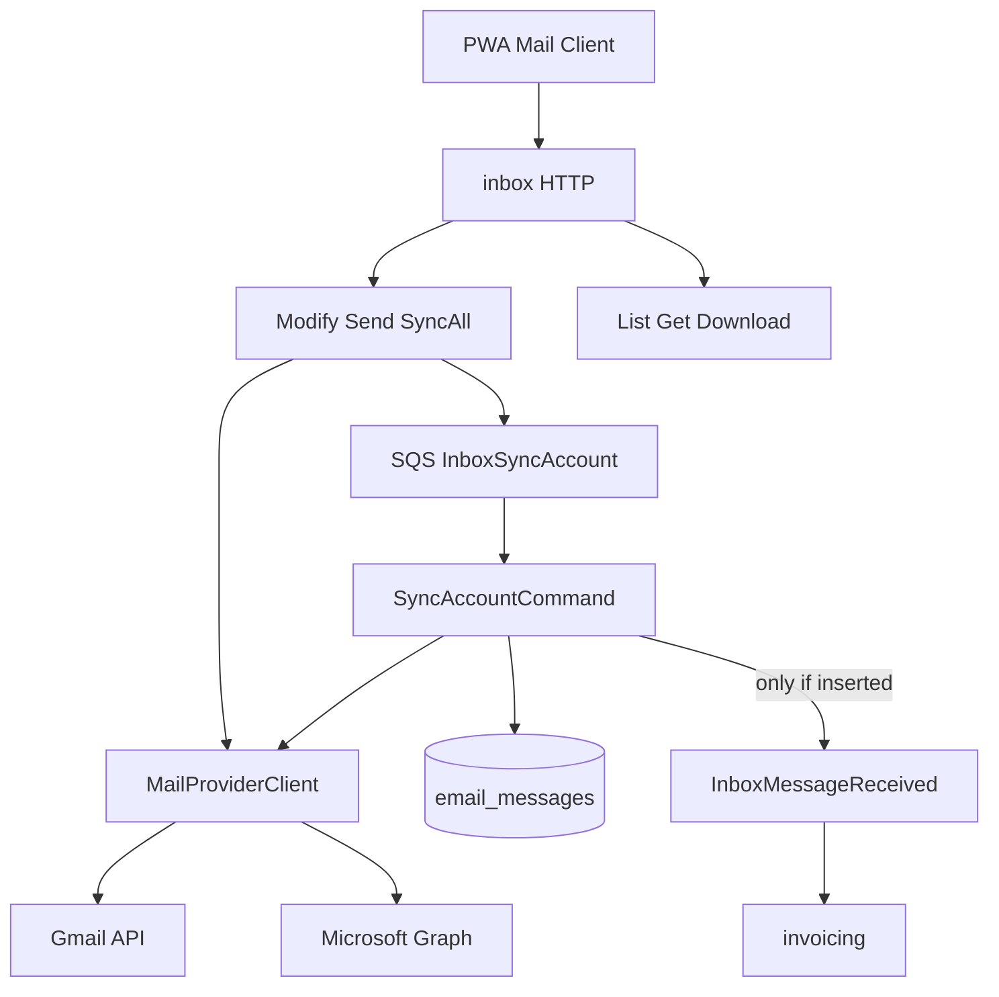

# Standard mail client design

**Spec**: `.specs/features/standard-mail-client/spec.md`
**Status**: Approved for implementation (MVP)

---

## Architecture overview

Inbox is no longer ingest-only. The `InboxMessage` aggregate becomes a mail message with folder/flags; `MailProviderClient` writes back to the provider; sync uses History/delta and SQS jobs. Invoicing still listens to `InboxMessageReceived`, emitted **only** on insert.



---

## Code reuse analysis

### Existing components to leverage

| Component                               | Location                                     | How to use                                 |
| --------------------------------------- | -------------------------------------------- | ------------------------------------------ |
| `MailProviderClient`                    | `inbox/domain/provider_client.go`            | Extend with History, Modify, Trash, Send   |
| `SyncAccountCommand`                    | `inbox/application/commands/sync_account.go` | History cursor + idempotent publish        |
| `jobs.Queue` / SQS poller               | `platform/jobs`                              | Sync dispatcher (same pattern as invoices) |
| Gmail `CreateLabel`/`AddLabelToMessage` | `gmail/client.go`                            | Base for `ModifyMessage`                   |
| Connections OAuth Google                | `connections/adapters/http/v1`               | Add `gmail.send`; clone Microsoft flow     |
| `SecureEmailBodyComponent`              | PWA inbox                                    | Unchanged; compose uses its own text/HTML  |
| SharingPolicy                           | connections domain                           | Filter list/get/modify by owner            |

### Integration points

| System          | Integration method                                               |
| --------------- | ---------------------------------------------------------------- |
| Gmail           | History + messages.modify/trash/send; scopes modify+send         |
| Microsoft Graph | messages list/get/sendMail/move; scopes Mail.ReadWrite+Mail.Send |
| SQS             | JobType `InboxSyncAccount`                                       |
| EventBridge     | `InboxMessageReceived` unchanged contract                        |
| S3              | Existing attachments; download via `FileStore.ReadFile`          |

---

## Components

### Domain mail model

- **Purpose**: Folder, flags, and recipients on `InboxMessage`.
- **Location**: `apps/backend/internal/inbox/domain/`
- **Interfaces**: `ApplyProviderLabels`, `MailFolder`, `OutgoingMail`
- **Reuses**: `NewInboxMessageFromProvider`

### Provider port

- **Purpose**: Provider-agnostic read + write.
- **Location**: `provider_client.go`
- **New methods**: `GetHistoryID`, `ListHistory`, `ModifyMessage`, `TrashMessage`, `SendMessage`

### Sync

- **Purpose**: Correct incremental sync and idempotent events.
- **Location**: `commands/sync_account.go`
- **Behavior**: If `cursor.HistoryID` → History; if 404 → list fallback. Publish event only when upsert inserted.

### SQS dispatcher

- **Purpose**: `POST /sync` does not block.
- **Location**: `commands/sqs_sync_dispatcher.go`, `adapters/jobs/sync_account_processor.go`, `contracts/jobs/`
- **Fallback**: Without a queue, keep the inline dispatcher (tests/local without SQS).

### Mail commands

- **Purpose**: Client actions.
- **Location**: `commands/modify_message.go`, `commands/send_message.go`

### HTTP / PWA

- **Purpose**: Folders, flags, compose, real attachments, pagination.
- **Endpoints**:
  - `GET /messages?folder&q&limit&offset&account_id`
  - `POST /messages` (send)
  - `POST /messages/{id}/read|unread|star|unstar|archive|trash`
  - `GET /messages/{id}/attachments/{attachmentId}`

---

## Data models

### InboxMessage (extended)

```
folder: inbox | sent | drafts | trash | spam | archive
is_read, is_starred, is_draft: bool
to_emails, cc_emails, bcc_emails: text[]
snippet: text
history_id on inbox_sync_cursors
```

### Gmail label mapping

| Labels               | Folder / flags  |
| -------------------- | --------------- |
| TRASH                | trash           |
| SPAM                 | spam            |
| DRAFT                | drafts          |
| SENT (and not INBOX) | sent            |
| INBOX                | inbox           |
| else                 | archive         |
| UNREAD absent        | is_read=true    |
| STARRED              | is_starred=true |

### OAuth scopes

| Provider  | Scopes                                                       |
| --------- | ------------------------------------------------------------ |
| Google    | `email`, `gmail.modify`, `gmail.send`                        |
| Microsoft | `offline_access`, `User.Read`, `Mail.ReadWrite`, `Mail.Send` |

---

## Decisions

- Keep `InboxMessageReceived` for invoicing; gate on insert.
- Default list folder is `inbox`.
- Starred is a virtual folder (`is_starred=true`, not trash).
- Send persists after provider success; next sync reconciles the SENT copy.
- Microsoft ships in the same MVP slice because the factory already declares the provider.
- Periodic EventBridge cron across tenants is P3; P1 is async jobs per user/connection-added trigger.
