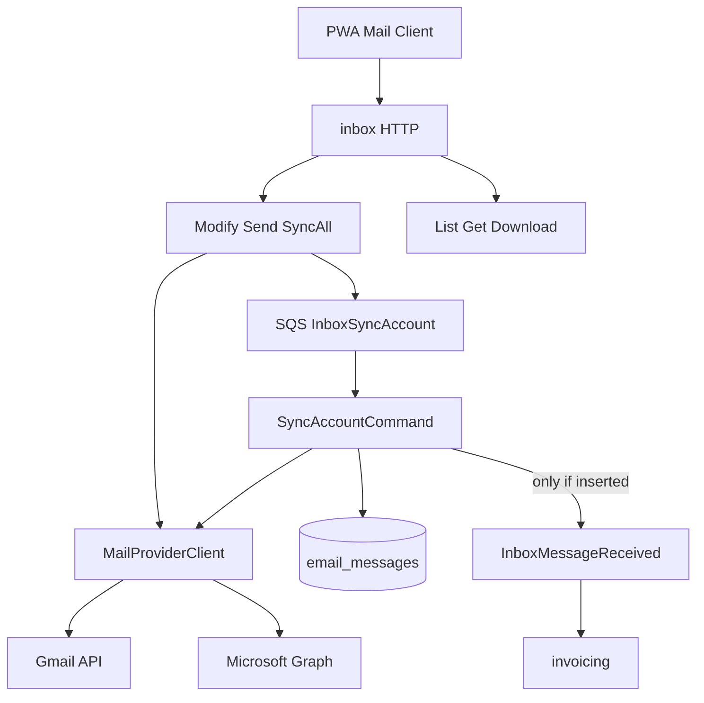

# Standard Mail Client Design

**Spec**: `.specs/features/standard-mail-client/spec.md`
**Status**: Approved for implementation (MVP)

---

## Architecture Overview

Inbox deja de ser solo ingesta. El agregado `InboxMessage` pasa a ser un mensaje de correo con folder/flags; `MailProviderClient` escribe de vuelta al proveedor; sync usa History/delta y jobs SQS. Invoicing sigue escuchando `InboxMessageReceived`, emitido **solo** en insert.



---

## Code Reuse Analysis

### Existing Components to Leverage

| Component                               | Location                                     | How to Use                                     |
| --------------------------------------- | -------------------------------------------- | ---------------------------------------------- |
| `MailProviderClient`                    | `inbox/domain/provider_client.go`            | Extender con History, Modify, Trash, Send      |
| `SyncAccountCommand`                    | `inbox/application/commands/sync_account.go` | History cursor + idempotent publish            |
| `jobs.Queue` / SQS poller               | `platform/jobs`                              | Dispatcher de sync (mismo patrón que invoices) |
| Gmail `CreateLabel`/`AddLabelToMessage` | `gmail/client.go`                            | Base de `ModifyMessage`                        |
| Connections OAuth Google                | `connections/adapters/http/v1`               | Añadir `gmail.send`; clonar flujo Microsoft    |
| `SecureEmailBodyComponent`              | PWA inbox                                    | Sin cambios; compose es texto/HTML propio      |
| SharingPolicy                           | connections domain                           | Filtrar list/get/modify por owner              |

### Integration Points

| System          | Integration Method                                               |
| --------------- | ---------------------------------------------------------------- |
| Gmail           | History + messages.modify/trash/send; scopes modify+send         |
| Microsoft Graph | messages list/get/sendMail/move; scopes Mail.ReadWrite+Mail.Send |
| SQS             | JobType `InboxSyncAccount`                                       |
| EventBridge     | `InboxMessageReceived` unchanged contract                        |
| S3              | Adjuntos existentes; download via `FileStore.ReadFile`           |

---

## Components

### Domain mail model

- **Purpose**: Folder, flags y destinatarios como parte de `InboxMessage`.
- **Location**: `apps/backend/internal/inbox/domain/`
- **Interfaces**: `ApplyProviderLabels`, `MailFolder`, `OutgoingMail`
- **Reuses**: `NewInboxMessageFromProvider`

### Provider port

- **Purpose**: Lectura + escritura provider-agnostic.
- **Location**: `provider_client.go`
- **New methods**: `GetHistoryID`, `ListHistory`, `ModifyMessage`, `TrashMessage`, `SendMessage`

### Sync

- **Purpose**: Incremental correcto e idempotente.
- **Location**: `commands/sync_account.go`
- **Behavior**: Si `cursor.HistoryID` → History; si 404 → list fallback. Publish event only when upsert inserted.

### SQS dispatcher

- **Purpose**: `POST /sync` no bloquea.
- **Location**: `commands/sqs_sync_dispatcher.go`, `adapters/jobs/sync_account_processor.go`, `contracts/jobs/`
- **Fallback**: Si no hay queue, se mantiene inline dispatcher (tests/local sin SQS).

### Mail commands

- **Purpose**: Acciones de cliente.
- **Location**: `commands/modify_message.go`, `commands/send_message.go`

### HTTP / PWA

- **Purpose**: Carpetas, flags, compose, adjuntos reales, paginación.
- **Endpoints**:
  - `GET /messages?folder&q&limit&offset&account_id`
  - `POST /messages` (send)
  - `POST /messages/{id}/read|unread|star|unstar|archive|trash`
  - `GET /messages/{id}/attachments/{attachmentId}`

---

## Data Models

### InboxMessage (extended)

```
folder: inbox | sent | drafts | trash | spam | archive
is_read, is_starred, is_draft: bool
to_emails, cc_emails, bcc_emails: text[]
snippet: text
history_id on inbox_sync_cursors
```

### Gmail label mapping

| Labels               | Folder / flags  |
| -------------------- | --------------- |
| TRASH                | trash           |
| SPAM                 | spam            |
| DRAFT                | drafts          |
| SENT (and not INBOX) | sent            |
| INBOX                | inbox           |
| else                 | archive         |
| UNREAD absent        | is_read=true    |
| STARRED              | is_starred=true |

### OAuth scopes

| Provider  | Scopes                                                       |
| --------- | ------------------------------------------------------------ |
| Google    | `email`, `gmail.modify`, `gmail.send`                        |
| Microsoft | `offline_access`, `User.Read`, `Mail.ReadWrite`, `Mail.Send` |

---

## Decisions

- Keep `InboxMessageReceived` for invoicing; gate on insert.
- Default list folder is `inbox`.
- Starred is a virtual folder (`is_starred=true`, not trash).
- Send persists after provider success; next sync reconciles the SENT copy.
- Microsoft is implemented in the same MVP slice because the factory already declares the provider.
- Periodic EventBridge cron across tenants is P3; P1 is async jobs per user/connection-added trigger.
